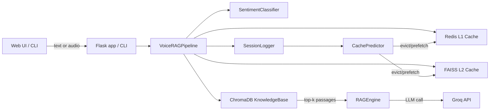

# VoiceRAG-Cache

Sentiment-aware Voice RAG agent with a two-tier cache:

- **L1 cache (Redis)** for exact-repeat queries (fastest).
- **L2 cache (FAISS)** for semantic paraphrases (still fast).
- **RAG fallback** using **ChromaDB retrieval** + **Groq LLM** generation.
- **GenAI cache predictor** that decides what to **prefetch** next (and what to evict), scaling its prefetch “aggressiveness” based on user sentiment.

This repo includes:

- A **web demo** (Flask) with text + browser-recorded voice queries.
- A **CLI demo** with text mode and full voice-in/voice-out mode.
- A small **evaluation harness** that simulates cache baselines.

## Why this project exists

Voice assistants feel “slow” when every turn requires retrieval + an LLM call. This project shows a practical approach to improving perceived latency:

- Cache what users are likely to ask again.
- Catch paraphrases (semantic cache).
- Use the current **sentiment** (urgent/confused/etc.) to decide how aggressively to prefetch follow-up queries.

## How it works (end-to-end)

At a high level, a single user turn runs this flow:

```text
User query (text or transcribed audio)
	→ Sentiment classification
	→ L1 Redis lookup (exact-match)
	→ L2 FAISS lookup (semantic-match)
	→ If both miss: retrieve from Chroma + generate with Groq
	→ Write-through: store answer in L1 + L2
	→ Log turn (sentiment, latency, hit/miss)
	→ GenAI predictor: evict + prefetch next queries (sentiment-aware)
```

Key implementation files:

- Pipeline orchestrator: pipeline.py
- Web server + routes: app.py
- RAG generation: rag/rag_engine.py
- Knowledge base + retrieval: rag/knowledge_base.py
- L1 cache: cache/l1_cache.py
- L2 cache: cache/l2_cache.py
- Sentiment classifier: sentiment/sentiment_classifier.py
- Predictor: predictor/cache_predictor.py

## Architecture (components)



## Prerequisites

- Python 3.10+ (tested with Python 3.12)
- Redis (required; L1 cache is always enabled)
- FFmpeg (required for Whisper audio decoding, especially for the web voice upload)
- A Groq API key (required for RAG generation and the cache predictor)

## Setup (Windows PowerShell)

```powershell
cd C:\Projects\VOICERAG_cache\VoiceRag-Cache

python -m venv venv
venv\Scripts\Activate.ps1

python -m pip install --upgrade pip
pip install -r requirements.txt
```

Install and start Redis (pick one):

- Docker:
	- `docker run --name voicerag-redis -p 6379:6379 -d redis:7`
- Or a native Redis install for Windows (varies by machine). Ensure it listens on `localhost:6379`.

Install FFmpeg (pick one):

- `winget install Gyan.FFmpeg`
- or `choco install ffmpeg`

Create a `.env` file in the repo root:

```env
GROQ_API_KEY=your_key_here
```

## Setup (macOS / Linux)

```bash
cd /path/to/VoiceRag-Cache

python3 -m venv venv
source venv/bin/activate

python -m pip install --upgrade pip
pip install -r requirements.txt
```

Install and start Redis + FFmpeg:

```bash
# macOS (Homebrew)
brew install redis ffmpeg
brew services start redis

# Linux (example)
# sudo apt-get update && sudo apt-get install -y redis-server ffmpeg
```

Create `.env`:

```bash
echo "GROQ_API_KEY=your_key_here" > .env
```

## Run (web demo)

```bash
python app.py
```

Open http://localhost:5000

### Web API routes

The web UI calls these JSON endpoints:

- `POST /query` with body `{ "query": "..." }`
- `POST /voice_query` with `multipart/form-data` field `audio` (recorded in the browser)
- `POST /switch_domain` with body `{ "domain": "healthcare" | "hr" | "legal" }`
- `POST /eval` runs the simulation-based benchmark
- `POST /reset` flushes caches and starts a new session

## Run (CLI demo)

Before running CLI mode, index a domain at least once (the web server auto-indexes on first startup; the CLI does not):

```bash
python -m rag.knowledge_base --domain healthcare
```

Then run:

```bash
# Text-only terminal mode
python main.py --text

# Full voice mode (mic input + TTS output)
python main.py --voice

# Run evaluation benchmarks
python main.py --eval
```

## Domains and the knowledge base

The knowledge base is a local **ChromaDB** store persisted to disk (default: `./data/chroma_db`).

Built-in domains (sample docs live inside rag/knowledge_base.py):

- `healthcare`
- `hr`
- `legal`

Index a domain:

```bash
python -m rag.knowledge_base --domain hr
```

## Two-tier caching details

### L1: Redis exact-match cache

- Stores `{query → answer}` under a key derived from a normalized query (case/whitespace normalized, then SHA-256 hashed).
- TTL is configurable.
- Used for “I asked the exact same thing again”.

Environment knobs:

- `REDIS_HOST` (default `localhost`)
- `REDIS_PORT` (default `6379`)
- `REDIS_DB` (default `0`)
- `REDIS_TTL` seconds (default `3600`)

### L2: FAISS semantic cache

- Stores sentence-embedding vectors for previous queries + their answers.
- On lookup, embeds the new query and returns the closest match if similarity ≥ threshold.
- Persists to `./data/l2_faiss.index` and `./data/l2_meta.pkl`.

Environment knobs:

- `L2_SIMILARITY_THRESHOLD` (default `0.85`)

## Sentiment-aware predictor (prefetch + evict)

The predictor is an LLM-based policy engine that reads the recent conversation (with sentiment + hit/miss info) and outputs JSON:

```json
{ "evict": ["..."], "prefetch": ["..."] }
```

Prefetch count scales with sentiment (see predictor/cache_predictor.py):

- neutral / satisfied → 2
- confused → 3
- urgent / escalating → 5

When a query is selected for prefetch, the pipeline calls RAG early and warms both L1 and L2.

Environment knob:

- `PREDICTOR_CONTEXT_WINDOW` (default `5` recent turns)

## Evaluation harness (what it means)

The evaluation in eval/evaluator.py is **simulation-based**. It uses fixed latency constants to compare:

- VoiceRAG-Cache (simulated L1/L2 + simulated predictor bonus)
- LRU baseline
- LFU baseline
- No-cache baseline

This is meant to visualize cache policy benefits without making real network calls.

## Data/artifacts written to disk

- `./data/chroma_db` — ChromaDB persistence
- `./data/l2_faiss.index`, `./data/l2_meta.pkl` — L2 cache
- `./data/sessions/*.json` — session logs

## Configuration reference

Minimum required:

- `GROQ_API_KEY` — used by the RAG engine and cache predictor

Optional:

- `CHROMA_PERSIST_DIR` (default `./data/chroma_db`)
- `WHISPER_MODEL` (default `base`)
- `REDIS_HOST`, `REDIS_PORT`, `REDIS_DB`, `REDIS_TTL`
- `L2_SIMILARITY_THRESHOLD`
- `PREDICTOR_CONTEXT_WINDOW`

## Troubleshooting

- Redis errors on startup
	- L1 cache connects during initialization and will raise if Redis isn’t running.
	- Fix: ensure Redis is reachable at `REDIS_HOST:REDIS_PORT`.

- Voice transcription fails / Whisper errors
	- Make sure FFmpeg is installed and available on PATH.
	- The web demo uploads `.webm`; Whisper typically relies on FFmpeg to decode it.

- PowerShell won’t activate venv
	- If `venv\Scripts\Activate.ps1` is blocked, run PowerShell as admin and set:
		- `Set-ExecutionPolicy -Scope CurrentUser RemoteSigned`

- Groq errors / empty answers
	- Verify `GROQ_API_KEY` is set in `.env` (or in your shell environment).

## Repo structure

- app.py — Flask web server
- main.py — CLI entrypoint (text/voice/eval)
- pipeline.py — orchestrates caches + RAG + predictor
- asr/ — Whisper microphone ASR helpers
- cache/ — L1 Redis and L2 FAISS caches
- rag/ — Chroma knowledge base + Groq-backed RAG engine
- predictor/ — session logger + sentiment-aware cache predictor
- sentiment/ — sentiment inference + optional training script
- tts/ — offline TTS (pyttsx3)
- eval/ — simulation benchmark harness
